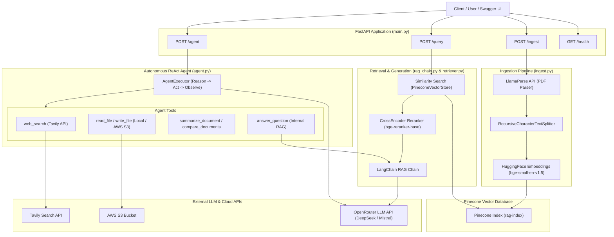

# Agentic RAG Engine

A production-ready RAG API and Autonomous Agent system built with **FastAPI**, **Pinecone**, **LangChain**, **LlamaParse**, and **OpenRouter**.

---

## System Architecture



---

## Features

- **Document Ingestion**: Upload PDFs and convert scanned/complex documents into clean markdown via LlamaParse before indexing into Pinecone.
- **Reranked Multi-Document Retrieval**: Perform metadata-filtered vector searches combined with cross-encoder re-ranking (`BAAI/bge-reranker-base`) for maximum context precision.
- **Autonomous ReAct Agent (`/agent`)**: LangChain-powered agent executing iterative reasoning loops (`Reasoning -> Acting -> Observing`) using custom tools.
- **Web Search Integration**: Access real-time web search capabilities via Tavily.
- **Cloud & Local Storage**: Read/write documents seamlessly between local storage and AWS S3 buckets.
- **Document Summarization & Comparison**: Built-in tools for Map-Reduce document summarization and cross-document comparison.
- **Docker Support**: Containerized setup via `Dockerfile` and `docker-compose.yml`.

---

## Tech Stack

- **Framework**: FastAPI & Uvicorn
- **Agent & Orchestration**: LangChain, LangChain Core, LangChain Community, `langchain-pinecone`
- **Vector Database**: Pinecone (`pinecone-client`)
- **LLM Provider**: OpenRouter API (`mistralai/mistral-7b-instruct-v0.3`, `deepseek/deepseek-v4-pro`)
- **PDF Parser**: LlamaParse (`llama-parse`)
- **Embeddings & Re-ranking**: `sentence-transformers` (`BAAI/bge-small-en-v1.5` & `BAAI/bge-reranker-base`)
- **External Tools**: Tavily API (`tavily-python`), AWS S3 (`boto3`)
- **Containerization**: Docker & Docker Compose

---

## Setup & Quickstart

### Prerequisites

- Python 3.11+
- Pinecone, OpenRouter, and LlamaParse API keys

### Option A: Local Virtual Environment

1. **Clone the repository**:
   ```bash
   git clone https://github.com/gaurang-bele/agentic-rag-engine.git
   cd agentic-rag-engine
   ```

2. **Create and activate a virtual environment**:
   ```powershell
   # On Windows PowerShell
   python -m venv .venv
   .\.venv\Scripts\Activate.ps1
   ```

3. **Install dependencies**:
   ```bash
   pip install --upgrade pip
   pip install -r requirements.txt
   ```

4. **Configure environment variables**:
   Create a `.env` file in the root directory (see example configuration below).

5. **Start the FastAPI server**:
   ```bash
   uvicorn main:app --reload
   ```

### Option B: Docker Compose

1. Create and configure your `.env` file.
2. Build and run the container:
   ```bash
   docker-compose up --build
   ```
3. The server will be accessible at `http://localhost:8000`.

---

## Environment Variables (`.env`)

```env
# Vector Database (Pinecone)
PINECONE_API_KEY=your_pinecone_api_key
PINECONE_INDEX=rag-index
PINECONE_NAMESPACE=llamaparse-v1
PINECONE_CLEAR_NAMESPACE_BEFORE_INGEST=false
PINECONE_REPLACE_SOURCE_ON_INGEST=true

# PDF Parsing (LlamaParse)
LLAMA_CLOUD_API_KEY=your_llama_cloud_api_key
LLAMAPARSE_RESULT_TYPE=markdown

# Embeddings & Retrieval
CHUNK_SIZE=500
CHUNK_OVERLAP=50
EMBEDDING_MODEL=BAAI/bge-small-en-v1.5
EMBEDDING_DEVICE=cpu
EMBEDDING_NORMALIZE=true
RETRIEVER_TOP_K=5
RETRIEVER_FETCH_K=20
ENABLE_RERANKING=true
RERANKER_MODEL=BAAI/bge-reranker-base

# LLM Configuration (OpenRouter)
OPENROUTER_MODEL=mistralai/mistral-7b-instruct-v0.3
OPENROUTER_HTTP_REFERER=http://localhost:8000
OPENROUTER_APP_TITLE=Agentic RAG API
OPENROUTER_API_KEY=your_openrouter_api_key

# Web Search Tool (Tavily)
TAVILY_API_KEY=your_tavily_api_key
WEB_SEARCH_MAX_RESULTS=5

# Storage (AWS S3)
AWS_ACCESS_KEY_ID=your_access_key
AWS_SECRET_ACCESS_KEY=your_secret_key
AWS_REGION=ap-south-1
S3_BUCKET_NAME=your_bucket_name

# Agent Controls
AGENT_MAX_ITERATIONS=8
```

---

## API Endpoints

- `GET /health`: Health check endpoint.
- `GET /`: Redirects directly to `/docs` (Interactive Swagger UI).
- `POST /ingest`: Upload a PDF file to parse with LlamaParse and index into Pinecone.
- `POST /query`: Query indexed documents with optional metadata filtering and re-ranking.
- `POST /agent`: Execute multi-step natural language instructions with the ReAct Agent.

### Sample `/query` Request

```json
{
  "question": "What is the OSI model?",
  "source": "CN.pdf",
  "page_from": 1,
  "page_to": 30,
  "top_k": 5,
  "rerank": true
}
```

### Sample `/agent` Request

```json
{
  "input": "Read docs/design_v2.txt, summarize it, and compare with docs/design_v1.txt"
}
```

---

## License

MIT License - Copyright (c) 2026 gaurang-bele
