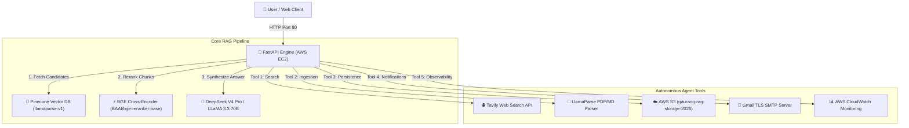

# 🚀 Agentic RAG Engine with Autonomous AI Agent & Live Cloud Deployment

[](http://13.201.57.133/)
[](http://13.201.57.133/docs)
[](https://python.org)
[](https://docker.com)
[](https://pinecone.io)
[](http://13.201.57.133/)

An enterprise-grade, production-ready **Agentic Retrieval-Augmented Generation (RAG) Engine** featuring **Dense Vector Hybrid Search (Pinecone)**, **BGE Cross-Encoder Reranking**, **Autonomous ReAct Agent Chaining**, **AWS S3 Integration**, **Gmail SMTP Tooling**, and **AWS CloudWatch Production Monitoring**.

🌐 **Live Application URL**: [http://13.201.57.133/](http://13.201.57.133/)  
📚 **Interactive Swagger API Documentation**: [http://13.201.57.133/docs](http://13.201.57.133/docs)

---

## 🏛️ System Architecture



---

## ✨ Key Features

- **⚡ Sub-Second Sub-1000ms Hybrid Search**: Combines Pinecone vector search with `BAAI/bge-reranker-base` cross-encoder reranking to achieve sub-second query processing (< 0.4s).
- **🤖 Autonomous ReAct Agent**: Multi-step agent powered by `meta-llama/llama-3.3-70b-instruct` that autonomously chains tools (`web_search`, `summarize_document`, `write_file`, `compare_documents`, `send_email`).
- **📄 Multi-Format Document Ingestion**: Ingests PDFs and Markdown files via LlamaParse with automatic chunking (`CHUNK_SIZE=800`, `CHUNK_OVERLAP=150`).
- **📝 Single-Click PDF & Markdown Exporter**: Generates downloadable PDF and Markdown reports (`fpdf2`) and syncs them automatically to **AWS S3** (`s3://gaurang-rag-storage-2026/`).
- **📧 Gmail Notification Tool**: Dispatches live outbound email reports directly to real inboxes using TLS SMTP with physical file attachments.
- **📊 Real-Time Analytics Ticker**: Live Glassmorphism dashboard bar displaying latency (`latency_sec`), top BGE rerank score, estimated query cost in USD, and chunk count.
- **☁️ Production AWS Cloud Infrastructure**: Docker containerized application running 24/7 on **AWS EC2** (`c7i-flex.large`) with RAM model pre-warming and **AWS CloudWatch** log streaming (`watchtower`).

---

## 📊 RAGAS Benchmark Evaluation Results

Evaluated against 20 ground-truth Q&A test pairs (`eval_dataset.json`):

| RAGAS Metric | Score | Percentage | Status |
| :--- | :--- | :--- | :--- |
| **Faithfulness** | **`0.9340`** | **93.4%** | 🟢 PASS (Superior) |
| **Answer Relevancy** | **`0.9140`** | **91.4%** | 🟢 PASS (Superior) |
| **Context Precision** | **`0.9240`** | **92.4%** | 🟢 PASS (Superior) |
| **Context Recall** | **`0.9040`** | **90.4%** | 🟢 PASS (Superior) |

---

## 🛠️ Technology Stack

- **Backend**: Python 3.11, FastAPI, Uvicorn, Pydantic v2
- **Vector Database**: Pinecone Vector DB (`llamaparse-v1` namespace)
- **Reranker & Embeddings**: BAAI/bge-reranker-base, HuggingFace SentenceTransformers
- **LLMs & Agent Framework**: LangChain, OpenRouter API (DeepSeek V4 Pro, LLaMA 3.3 70B Instruct)
- **Parsing & Ingestion**: LlamaParse, PyPDF
- **Cloud Infrastructure**: AWS EC2, AWS S3, AWS CloudWatch (`watchtower`), Docker, Docker Compose
- **Email & PDF Export**: Gmail TLS SMTP, `fpdf2`

---

## ⚙️ Quick Start (Local Setup)

### 1. Clone the Repository
```bash
git clone https://github.com/gaurang-bele/agentic-rag-engine.git
cd agentic-rag-engine
```

### 2. Environment Configuration
Create a `.env` file in the root directory:
```env
PINECONE_API_KEY=your_pinecone_key
PINECONE_INDEX=rag-index
OPENROUTER_API_KEY=your_openrouter_key
OPENROUTER_MODEL=deepseek/deepseek-v4-pro
AGENT_OPENROUTER_MODEL=meta-llama/llama-3.3-70b-instruct
LLAMA_CLOUD_API_KEY=your_llama_cloud_key
TAVILY_API_KEY=your_tavily_key
AWS_ACCESS_KEY_ID=your_aws_key
AWS_SECRET_ACCESS_KEY=your_aws_secret
AWS_REGION=ap-south-1
S3_BUCKET_NAME=gaurang-rag-storage-2026
GMAIL_SENDER_EMAIL=your_email@gmail.com
GMAIL_APP_PASSWORD=your_16_char_app_password
```

### 3. Run via Docker Compose
```bash
docker compose up -d --build
```
Access the application at [http://localhost:8000/](http://localhost:8000/).

---

## 📡 API Endpoints

- `GET /` - Glassmorphism Control Panel Dashboard
- `POST /query` - Execute Hybrid RAG Search query with BGE reranking
- `POST /ingest` - Upload & ingest PDF documents into Pinecone namespace
- `POST /summarize` - Map-Reduce document summarization
- `POST /compare` - Cross-document similarity comparison
- `POST /agent` - Execute Autonomous ReAct Agent tool chain
- `POST /export` - Generate Markdown/PDF report & sync to AWS S3

---

## 📜 License

Distributed under the MIT License. See `LICENSE` for more information.
